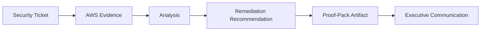

# 🛡️ Ninobyte AI Security & Governance Lab — AWS Edition

**Secure, audit, investigate, and govern AWS AI workloads using evidence-based job simulation.**

The AI Security & Governance Lab — AWS Edition is a six-week, AWS-native, ticket-driven job simulation for cloud security, GRC, audit, and AI governance professionals. Instead of passive lessons, learners work realistic tickets against a governed AWS AI workload, gather evidence, analyze findings, recommend remediation, and produce portfolio-ready proof-pack artifacts. The emphasis is defensive and evidence-based throughout.

> This repository is a **public overview only**. The full product, curriculum, and governance materials live in a private repository.

---

## Who it is for

- Cloud security engineers
- Technical GRC analysts
- IT auditors
- Security managers
- AI governance professionals

---

## 🧪 What learners practice

- Mapping an AWS AI workload
- Reviewing IAM and access boundaries
- Inspecting CloudTrail and CloudWatch evidence
- Evaluating S3 data exposure with Macie
- Validating Bedrock Guardrails
- Investigating suspicious model-invocation activity
- Producing a proof pack and an executive AI risk memo

---

## Ticket-driven workflow

Every ticket moves from a realistic prompt to sanitized evidence, to analysis, to a recommendation, and finally to an artifact a reviewer or executive can act on.

---

## 🧾 Proof-pack model

Learners build five categories of portfolio-safe artifacts:

1. AWS AI Architecture & Threat Model
2. IAM and Data Exposure Audit
3. Bedrock Guardrail Implementation Record
4. AI Security Incident Investigation Note
5. Executive AI Risk Memo

See [`PROOF_PACK_OVERVIEW.md`](PROOF_PACK_OVERVIEW.md) for a high-level explanation.

---

## Why AWS-only

We go deep on one cloud rather than skimming many. Production AI security work happens against concrete primitives — Bedrock, IAM, CloudTrail, CloudWatch, S3, Macie, and Guardrails — and durable skill comes from working those primitives directly, not from provider-agnostic theory. AWS-first depth makes the evidence real and the practice transferable.

---

## Defensive only

This lab is **defensive-only**: protection, detection, audit, and governance. It does not publish, request, or reward exploit payloads or jailbreak prompts, and it uses synthetic scenarios and synthetic evidence — never real customer data. See [`RESPONSIBLE_USE.md`](RESPONSIBLE_USE.md).

---

## 🔒 What is private

Kept private by design in the product repository:

- The full ticket library
- Proof-pack templates
- The lab's scenario architecture (a synthetic support-group environment)
- The synthetic evidence model
- Cost and safety gates
- Internal governance documentation

## 🚫 What this overview does not contain

- Solution guides or instructor notes
- AWS credentials
- Terraform or infrastructure code
- Internal governance details
- Exploit payloads or jailbreak prompts
- Live lab access

---

## ✅ Status

Docs-first product foundation complete; AWS execution remains gated behind cost and safety validation.

---

## Next step

Explore the [Ninobyte CloudOps Lab organization](https://github.com/ninobyte-cloudops-lab) for the full picture, including the [AI-Native CloudOps Lab](https://github.com/ninobyte-cloudops-lab/cloudops-lab-overview). For partnership, cohort, or review conversations, reach Ninobyte through its official channels.
